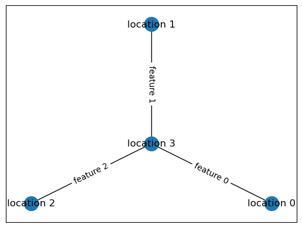

# Tree of Tangles


```python
from tangles_tot._testing.feature_trees import three_star
from tangles_tot.plot import plot_feature_tree

plot_feature_tree(three_star(True))
```


    

    


```python

```
